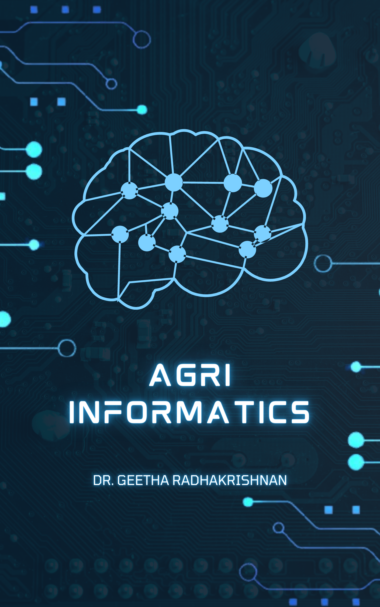

---
title: "MULTIVARIATE DATA ANALYSIS TOOLS FOR AGRICULTURAL RESEARCH"
author: "Dr. PRATHEESH P GOPINATH"
date: "2023-10-20"
site: bookdown::bookdown_site
documentclass: book
bibliography: [book.bib]
biblio-style: apalike
link-citations: yes
github-repo: https://github.com/KAUMELON/stat3202
description: "TRAINING MANUAL DEPARTMENT OF AGRICULTURAL STATISTICS"
cover-image: images/cover.PNG
---  
 

# Welcome {-} 
<p style="text-align: center;"><a href="https://coavellayani.kau.in/people/sub-lt-dr-pratheesh-p-gopinath"></a></p>  
Welcome to the online version of the book **MULTIVARIATE DATA ANALYSIS TOOLS - TRAINING MANUAL**.  
<p>Welcome to the "Multivariate Data Analysis Tools for Agricultural Research" training manual, a specialized resource tailored for agricultural researchers leveraging the R programming language for data analysis. In the realm of agricultural research, where multidimensional datasets hold the keys to improving crop yields, soil health, and sustainable farming practices, this manual equips you with the essential knowledge and skills to unlock actionable insights. From fundamental concepts to practical applications, our training explores techniques like PCA, Factor Analysis, Cluster Analysis, and more, all within the context of agricultural research. With the power of R at your fingertips, you'll harness the full potential of your agricultural data, making informed decisions to drive innovation and advancement in the field of agriculture.</p> 

<p>The content of this manual has been carefully designed to ensure that it is presented in a simple and straightforward manner, making it accessible to individuals of all levels of expertise. Our aim is to demystify complex concepts, providing clarity and ease of understanding so that anyone, regardless of their background, can grasp and apply these fundamental principles of multivariate data analysis in agricultural research with confidence.</p>


# Preface {-}  
<p style="text-align: justify;">
</p>   
```{r logo, echo=FALSE,out.width="80%", fig.align='center'}
knitr::include_graphics(rep("docs/info.png"))
```
<p style="text-align: justify;"> **Note**: This training Manual is published in MeLoN (Module for e-Learning & Online Notes) by Department of Agricultural Statistics . The online version of this book is free to read here.</p> 
````{=html}
<a rel="license" href="http://creativecommons.org/licenses/by-nc-nd/4.0/"></a><br />This work is licensed under a <a rel="license" href="http://creativecommons.org/licenses/by-nc-nd/4.0/">Creative Commons Attribution-NonCommercial-NoDerivatives 4.0 International License</a>.
````
<p>If you have any feedback, please feel free to contact [Dr.Pratheesh P. Gopinath](https://coavellayani.kau.in/people/dr-pratheesh-p-gopinath). E-mail: `pratheesh.pg@kau.in` Thank you!</p>  


